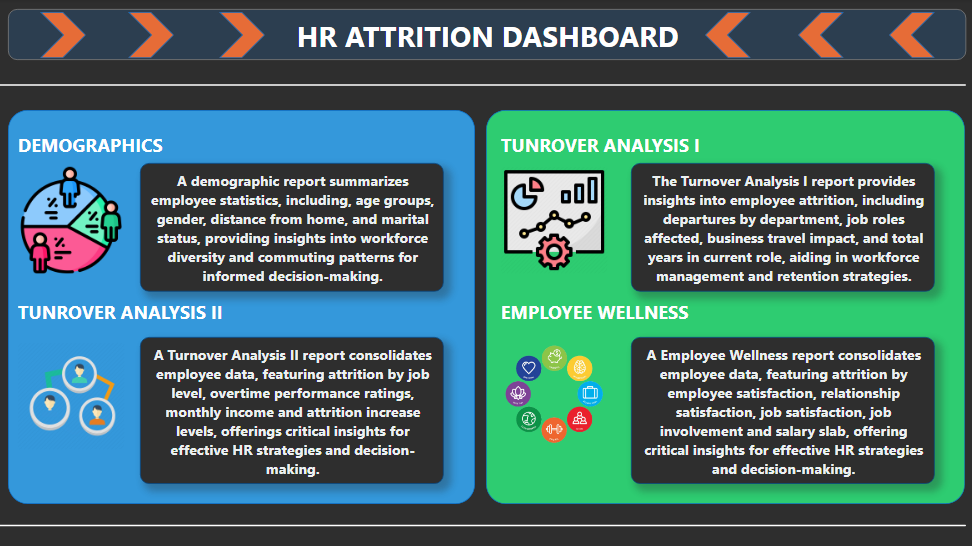
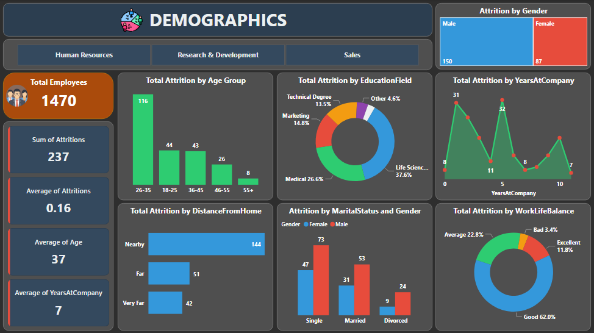

# HR-Attrition-Analysis

## Overview
This project, the HR Attrition Dashboard, is a comprehensive analysis tool developed during my internship at Meriskill. The dashboard offers insights and visualizations focused on understanding and addressing employee attrition within the organization. It covers demographic details, and turnover analysis, and provides a holistic view of the HR landscape.

## Data Enhancements

### 1. Additional Columns in Raw Data:
   - **Age Group:**
     - A new column categorizing employees into specific age groups.
   - **Salary Slab:**
     - A new column classifying employees into salary slabs.

### 2. Power Query Transformations:
   - Utilized Power Query to perform data cleaning, transformation, and enrichment, ensuring data accuracy and relevance.
   - Applied custom transformations to derive meaningful insights, including the conversion of numeric satisfaction ratings into descriptive categories.

## Dashboard Features

### 1. Overview Dashboard:
   - A high-level summary of all dashboards.
   - Quick navigation to specific sections.

### 2. HR Attrition Dashboard:
   - **Attrition Analysis:**
     - Breakdown of attrition rates.
     - Identification of key attrition factors.
   - **Demographic Insights:**
     - Visualizations highlighting workforce demographics.
     - Insights into the distribution of employees based on various factors.
   - **Turnover Analysis:**
     - Two detailed turnover analysis sections focusing on different aspects.
   - **Employee Wellness:**
     - Dedicated section to understand and monitor employee well-being.

## Screenshots

For Detailed Info

Download PBIX File
- You can download the Power BI PBIX file [here](HR%20Attrition.pbix).

## Acknowledgements
This project was developed during my internship at Meriskill.
